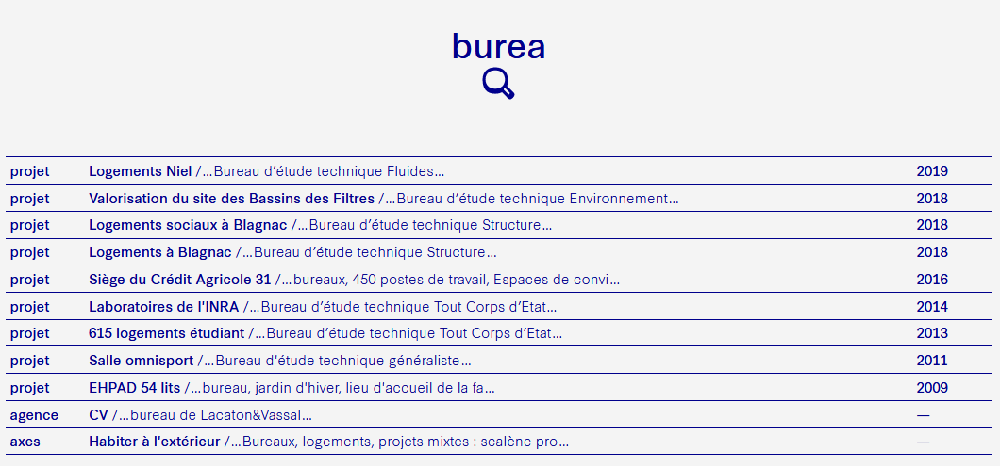

# TinySearch
Un moteur de recherche full-text en Elixir développé pour scalene.fr



## Principe

Le **moteur de recherche** est constitué d'un index stockant les documents indexés et de fonctions permettant d'insérer, mettre à jour, et supprimer des entrées de cet index. Chaque **entrée** est constituée d'un nom, d'une date, de l'URL de la page concernée, des fragments de texte originaux, et de l'index de recherche constitué à partir du texte **traité**.

On insère dans le moteur de recherche des **modèles** (sur ce site, des Projets, des fragments de la page "Agence"), qui sont des **structures de données différentes**. Pour cela, on **extrait récursivement tous les champs étant des chaînes de caractères** et provenant de ces modèles. On pourrait bien entendu utiliser une **liste d'autorisation** ou une transformation de données afin de ne prendre en compte que les champs pertinents. Ce texte est ensuite traité de cette manière :

```
texte brut
|> split sur les espaces via regex
|> join via une espace ascii
|> retrait des tags HTML
|> split sur les espaces ascii
|> map ( normalisation du mot )
|> filter ( retrait des mots-stop )
|> unique
```

L'index ne contient donc après ces opérations que des mots uniques pour ce modèle, normalisés, et ne contenant pas de mots-stop. **Les mots-stop** sont les articles, déterminants, et mots n'ayant pas d'intérêt pour la recherche. Une liste satisfaisante en a été trouvé sur internet.
Une possibilité serait aussi de **remonter au lemme** de chaque mot, une forme normalisée supprimant les pluriels, la conjugaison, etc. Ainsi, la forme **"mangent" pourrait être lemmatisé à "manger"**.
